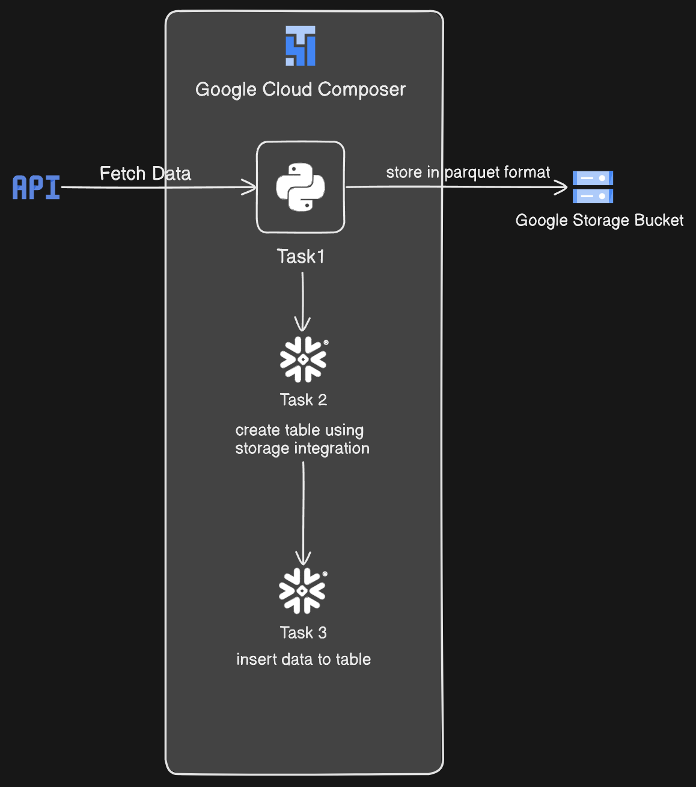
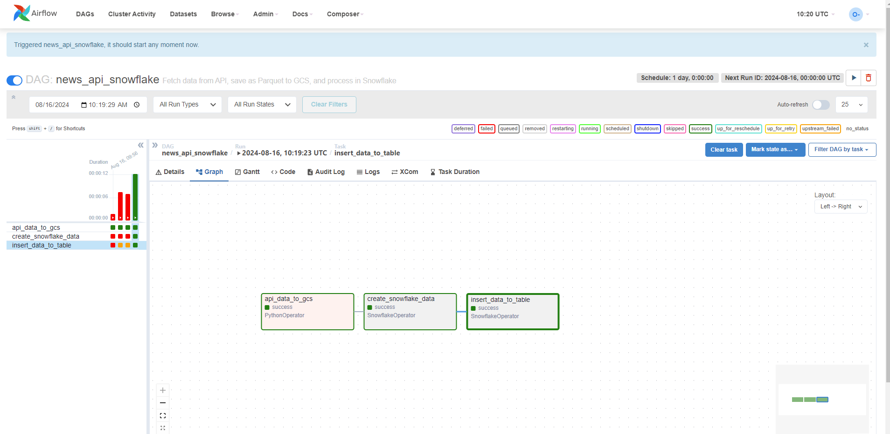

# API-to-Snowflake ETL Pipeline

## Table of Contents
- [Project Overview](#project-overview)
- [Architecture](#architecture)
- [Tech Stack](#tech-stack)
- [Pipeline Workflow](#pipeline-workflow)
- [Challenges and Solutions](#challenges-and-solutions)
- [Screenshots](#screenshots)
- [Contact](#contact)

## Project Overview
This project showcases an ETL (Extract, Transform, Load) pipeline that automates the process of fetching data from an API, transforming it, and loading it into Snowflake. The data is stored in Google Cloud Storage (GCS) in Parquet format after fetching from api. The workflow is orchestrated using Google Cloud Composer, integrating with Snowflake to load and process the data.

## Architecture

## Tech Stack
- **Languages**: Python, SQL
- **Google Cloud Storage (GCS)**: Used to store the transformed data in Parquet format.
- **Snowflake**: A data warehouse where the final data is stored.
- **Google Cloud Composer (Apache Airflow)**: Orchestrates the ETL pipeline.
- **APIs**: Source of data for extraction.
- **Google Cloud Libraries**: For interaction with GCS and Snowflake.

## Pipeline Workflow
1. **Extract and Transform Data**:
    - **Task**: A Python script is used to fetch data from the API, transform it by selecting the required columns, and store it in Parquet format in GCS.
    - **Tools**: Python, Google Cloud Storage libraries.
    - **Outcome**: Data is stored efficiently in GCS for further processing.

2. **Create Storage Integration in Snowflake**:
    - **Task**: Create a storage integration in Snowflake, granting the required permissions to access the GCS bucket.
    - **Purpose**: This enables Snowflake to securely access the Parquet files stored in GCS.

3. **Create Stage and Load Data into Snowflake**:
    - **Task**: A Snowflake stage is created pointing to the Parquet file in GCS. 
    - **Task**: Using the Snowflake Operator in Google Cloud Composer, a Snowflake SQL query is executed to create a table based on the data in the stage.

4. **Insert Data into Snowflake Table**:
    - **Task**: Data is inserted from the stage into a Snowflake table as the final step in the ETL process.
    - **Outcome**: The data is now available in Snowflake for analysis or further processing.

## Challenges and Solutions
**Challenge 1**: Configuring proper access between Snowflake and GCS.
- **Solution**: Set up a storage integration in Snowflake with appropriate permissions for the service principal to access the GCS bucket.

**Challenge 2**: Ensuring data integrity during the transformation and load process.
- **Solution**: Implement rigorous data validation in the Python script and use Snowflake’s robust SQL capabilities to ensure data consistency.

## Screenshots
1. **Pipeline Workflow**:
    - 
    - Screenshot showing the orchestration of tasks in Google Cloud Composer.

## Contact
For more information or to connect with me:

- **LinkedIn**: [https://www.linkedin.com/in/omkar-desai-0075a7192/](#)
- **Email**: [omkarbkishor@gmail.com](#)
